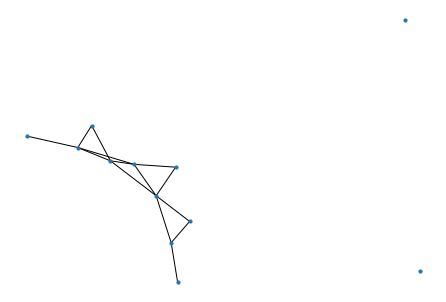

NetworkX -- Numerical Error Associated with Computing Eigenvalues for the Laplacian Matrix of a Graph
========

Example
--------------

Python version: 3.7  
NetworkX version: 2.5



Here, we have unweighted graph H with 3 visible connected components generated using the NetworkX software library.  


Explanation
--------------
```python
eig=nx.laplacian_spectrum(H)
print(eig)
connected_components = nx.number_connected_components(H)
print(connected_components)
```
The above code is used to compute the number of connected components in H and the eignvalues of the the Laplacian matrix of graph H. There's a theorem in spectral graph theory that says that the number of times 0 appears an eigenvalue in the set of eigenvalues of the Laplacian matrix of a graph is equal to the number of connected components in the graph (proof can be found here on page 7: http://math.uchicago.edu/~may/REU2013/REUPapers/Marsden.pdf).  As such, we should expect 3 zeros in the set of eigenvalues of the Laplacian matrix of graph H to represent the 3 connected components.  However, when the above code is run, the output is the following:

```python
[-8.26400576e-16 -3.26713193e-16  1.35110155e-16  3.93963788e-01
  9.01615190e-01  1.35600317e+00  1.65251364e+00  3.23825884e+00
  3.82794165e+00  4.85367430e+00  5.42579703e+00  6.35023240e+00]
3
```
The output does not contain any 0s.  It seems to be the case that NetworkX does not compute eigenvalues of the laplacian matrix of H properly.  
